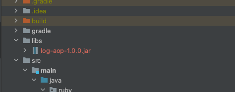

## Log AOP
- 메소드 호출 Log 를 출력하기 위한 Spring AOP

<br>

## Settings 
### 라이브러리 추가
  
```groovy
dependencies {
    implementation files('libs/log-aop-1.0.0.jar')
}
```
```yaml
log-trace: "on"
```

<br>

### Example
```java
@Slf4j
@RestController
@RequestMapping("/api/bus-stations")
@RequiredArgsConstructor
public class BusStationController {

    private final BusStationService busStationService;

    @LogTrace
    @GetMapping
    public BusStationListDTO getBusStations(BusSearchConditionDTO searchCondition) {
        Page<BusStation> busStationPage = busStationService.getBusStationsBySearchCondition(searchCondition);
        return new BusStationListDTO(busStationPage);
    }
}
```
